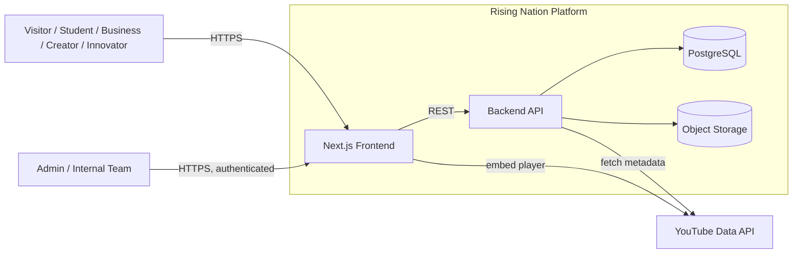
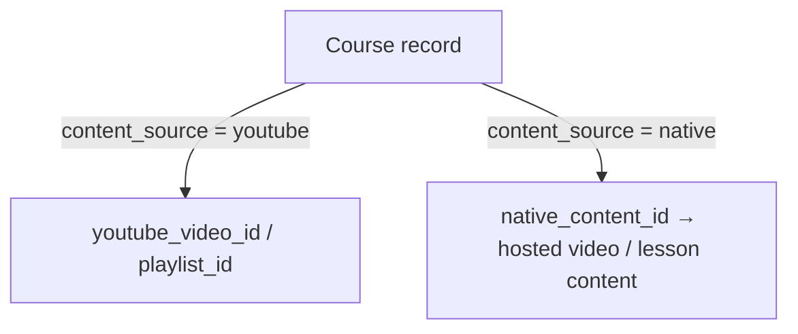
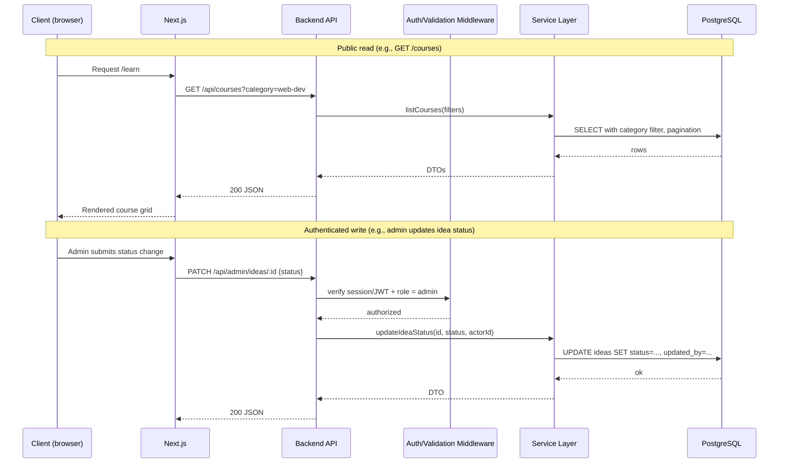

# Architecture — Rising Nation (Proposed)

> Everything in this document is **Recommended** unless marked **Confirmed (spec)**. This is a proposal to build against, not a description of existing code. See `REQUIREMENTS.md` for the source constraints driving each decision.

## 1. Design goals, in priority order

Derived directly from the spec's Final Requirement section and the recurring "no rebuild" constraint:

1. **Content-source independence for Learning** (Confirmed constraint — Section 3.1/11): swapping YouTube-hosted courses for native courses must not require a redesign.
2. **Mobile-first, fast** (Confirmed — Final Requirement).
3. **Non-engineers can manage content** (Confirmed — Section 11: Admin/CMS).
4. **Expandable** without rearchitecting (Confirmed, general).

These four goals rule out a fully static/hand-coded site (fails #3) and argue against tightly coupling the Learning module to the YouTube API's data shape (fails #1).

## 2. Proposed stack

| Layer | Choice | Why |
|---|---|---|
| Frontend | Next.js (React) | Mobile-first, SSR/SSG for fast first paint, single codebase for marketing pages + app-like sections (submission forms, opportunity applications). |
| Backend | Node.js/Express (or Next.js API routes if team wants one repo) | Matches frontend language, minimizes context-switching for a small team. |
| Database | PostgreSQL | The domain is heavily relational (People ↔ Projects ↔ Opportunities ↔ Ideas), which favors relational integrity over a document store. |
| Admin/CMS | Custom admin panel (not a generic headless CMS) | The spec's admin actions are workflow actions (review idea → change status → assign credit), not generic content editing — a workflow-aware custom panel serves this better than Contentful/Strapi's generic CRUD. |
| Media storage | S3-compatible object storage | Screenshots, thumbnails, profile photos (Sections 8, 9, 11). |
| Video | YouTube Data API (metadata) + `<iframe>` embed (playback) — see §4 | Required by spec; must not be the only supported source (§4). |
| Auth | Session or JWT-based auth, role-based access | Needed for Admin (Confirmed) and for any user-facing "Contributor/Builder" state (Inferred — see `REQUIREMENTS.md` open item #2). |

**Needs confirmation before locking this in:** whether the client has an existing hosting preference, and whether general users need accounts at all (drives whether auth is admin-only or platform-wide — materially changes scope).

## 3. System context

## 4. The Learning content-source abstraction (Confirmed constraint → design)

The spec's hard requirement — YouTube now, native later, **no redesign** — means the `courses` table must not hard-code "youtube_url" as its only content pointer. Proposed shape:

- `courses.content_source` is an enum: `youtube | native`.
- `courses.content_ref` stores the source-specific identifier (a YouTube video/playlist ID, or a foreign key to a future `native_lessons` table).
- The frontend course-card component renders a YouTube `<iframe>` embed or a native player based on `content_source`, but the **card UI, category browsing, and admin CRUD screen are identical either way.**
- Consequence: adding native courses later means adding a `native_lessons` table and a branch in the player component — not touching categories, cards, admin list views, or the Learning page routing.

This directly satisfies Section 3.1 and Section 11's repeated constraint.

## 5. Request lifecycle (typical read + typical write)

## 6. Authorization model (proposed)

Needed because Section 11 requires admin-gated content management and Section 3.3/4 require status changes only "the team" can make.

| Role | Can do |
|---|---|
| `public` (unauthenticated) | Read published content; submit Idea, Business enquiry, Creator enquiry, Opportunity application. |
| `member` *(Needs confirmation — see open item #2)* | Same as public, plus: track own submissions, view own growth level/portfolio, if user accounts are in scope at all. |
| `admin` | Full CRUD on Courses, Projects, Team members, Opportunities, Ideas, Mentors, Events, Announcements, website content (Confirmed — Section 11); review/update Idea status; promote a user's growth level. |

**Recommendation:** ship with `public` + `admin` only for V1 (see `ROADMAP.md`). Adding `member` accounts later is additive (new table, new auth flows) and doesn't break the content-source or admin design above — deferring it reduces V1 scope without a rebuild risk.

## 7. Cross-cutting concerns not specified by the client

The spec is silent on these; each is a build-blocking decision, so a default is proposed and flagged:

| Concern | Recommendation | Rationale |
|---|---|---|
| Validation | Server-side schema validation on all form endpoints (Idea, Business enquiry, Creator enquiry, Application) | These are the platform's only unauthenticated write paths — they're the injection/spam surface. |
| Rate limiting | Rate-limit the four public form endpoints above | Same reason — public POST endpoints with no auth are the realistic abuse target. |
| Email notification | Notify admin on new Idea/Enquiry/Application submission | Implied by "Admin should be able to review" (Section 4) — a review workflow needs a trigger. |
| Pagination | All list endpoints (`/courses`, `/projects`, `/people`, `/opportunities`) paginated from day one | "Ready to expand as Rising Nation grows" (Confirmed, Final Requirement) — unbounded queries fail this goal as data grows. |

## 8. Explicit non-goals for V1

Documented so they aren't accidentally designed against: payments/checkout (no commerce requirement in spec), multi-language, real-time/WebSocket features (nothing in spec implies live updates), and native course *hosting infrastructure* (only the data model needs to support it — see §4; actual native video hosting is a later decision).
