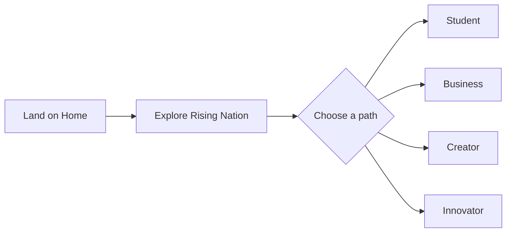
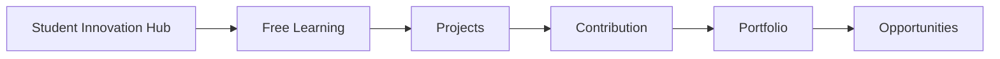
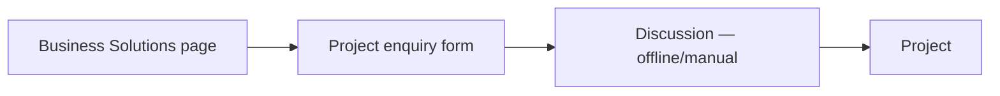
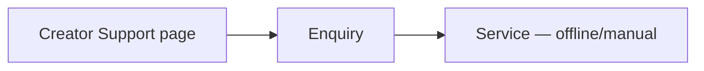
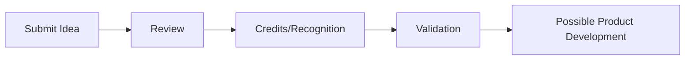

# User Flows — Rising Nation

Source: `REQUIREMENTS.md` §12 (Confirmed, verbatim structure from spec). Each flow below is annotated with the screens/endpoints from `API.md` that implement it — annotations are **Recommended**, the flow itself is **Confirmed (spec)**.

## Visitor

Implementation: Home (`GET /projects?featured=true`, `GET /people?featured=true`) surfaces the four entry points as nav/CTA cards per Section 1.

## Student

Implementation:
- Free Learning → `GET /courses?category=`
- Projects/Contribution → `GET /projects`, `GET /opportunities?type=contributor`, `POST /opportunities/:id/apply`
- Portfolio → profile view aggregating a student's `PROJECT_MEMBERS` rows (Needs confirmation whether this is a public URL or account-gated — see `REQUIREMENTS.md` open item #2)
- Opportunities → `GET /opportunities`

This flow is also where the Growth ladder (Learner → Contributor → Intern → Builder → Lead) applies — progression is admin-driven off the back of Contribution activity, not a self-service step in this flow.

## Business

Implementation: `GET /categories?type=service&group=business` renders the service list; `POST /enquiries {type: business_solutions}` submits the form; "Discussion" is explicitly outside the platform (spec implies manual follow-up, not an in-app chat — nothing in the spec suggests otherwise); "Project" is a `PROJECTS` record created manually by admin once work is scoped.

## Creator

Implementation: identical mechanism to Business, `type: creator_support`.

## Innovator

Implementation: `POST /ideas` → admin moves through `ideas.status` via `PATCH /admin/ideas/:id`. Per `REQUIREMENTS.md` §4, the UI/copy at every stage after submission must avoid implying guaranteed funding or development — this is a hard constraint on the *copy* shown at states C–E, not just the data model.

## Cross-flow note: Idea → Product (Section 7) is not a sixth flow

Section 7 restates the Innovator pipeline as a public-facing explainer (`IDEA → VALIDATE → DESIGN → BUILD → TEST → LAUNCH → GROW`) with a "Submit Your Idea" CTA. It reuses the same `POST /ideas` endpoint and `ideas.status` states above — it is presentation of the Innovator flow, not a distinct one, so no separate diagram or endpoints are proposed for it.
