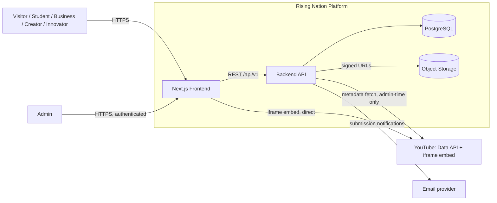
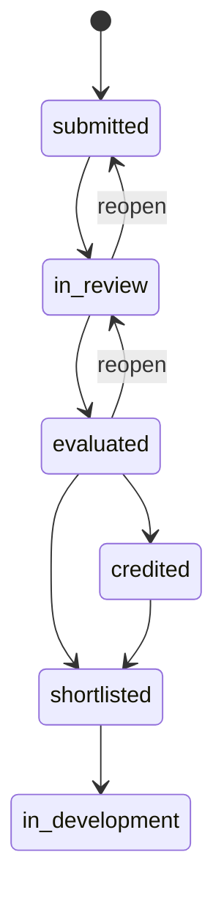

# Architecture — Rising Nation

**Proposed** system design. Nothing here is implemented. Cross-references `REQUIREMENTS.md` (REQ-IDs) and `DATABASE.md` (entities).

## 3.1 System Context

**Users:** Visitor/Student/Business/Creator/Innovator (public, unauthenticated) and Admin (authenticated). **Frontend:** Next.js, serves both public pages and the admin panel. **Backend:** a single stateless API service. **Database:** PostgreSQL (`DATABASE.md`). **External systems:** YouTube (Data API + embed), an email provider. **Storage:** S3-compatible object storage for screenshots/thumbnails/photos/documents.



## 3.2 Architecture Overview

```text
Client (Next.js)
  ↓
API Layer (routing, request parsing, response shaping)
  ↓
Middleware (auth, validation)
  ↓
Service Layer (business rules, transaction boundaries)
  ↓
Repository Layer (parameterized queries only)
  ↓
PostgreSQL
```

This layered style is appropriate here — not adopted for its own sake — because the platform's two highest-risk operations (idea status transitions, opportunity applications; see §3.7) have business rules (legal state transitions, race-condition handling) that need to be unit-testable independent of a live database, and need to live in exactly one place rather than duplicated across route handlers. A flatter design (business logic inline in route handlers) would make those rules untestable without a database and prone to drifting between endpoints that touch the same entity.

**Why each layer exists:**
- **API layer** — HTTP is a protocol concern (routing, status codes, headers); isolating it means the service layer knows nothing about HTTP.
- **Middleware** — authentication/authorization is identical logic across dozens of routes; a shared middleware makes "did we forget an authz check" a reviewable property of the route table, not something buried per-handler.
- **Service layer** — the only place business rules exist. Repositories never contain business logic; controllers never contain business logic.
- **Repository layer** — isolates SQL/query construction so the service layer is testable against a mocked repository, and so query patterns are centralized for the indexing review in `DATABASE.md`.
- **PostgreSQL** — see `DATABASE.md` Database Overview for why relational.

No additional layers are introduced: no GraphQL resolver layer (REST is sufficient — nothing in `REQUIREMENTS.md` implies client-driven query shaping), no CQRS/event sourcing (write volume is low; an audit-history table, not event sourcing, satisfies the accountability requirement — see §3.8), no API gateway beyond the framework's own router (one backend service, not several).

## 3.3 Backend Architecture

**API Layer** — Routing, request parsing, response formatting, HTTP semantics (status codes per `API.md`'s error model). Owns nothing about business rules.

**Validation Layer** — Schema validation (types, required fields, enum membership, string length bounds) runs before authentication, since a malformed request should fail cheaply without touching auth/database at all. Input normalization (trimming, casing) also happens here. Validation errors return `400` immediately.

**Authentication** — Verifies identity via session/token (`§3.6`). Runs after schema validation, before authorization — no point checking permissions for a request that isn't even from a verified identity.

**Authorization** — Verifies the authenticated identity's role permits the requested operation (`role = admin` for `/admin/*`). Checked before any resource is fetched, so an unauthorized request never leaks whether a resource exists (`403`, not a data-revealing `404` — see `ENGINEERING.md` §6.1 IDOR entry).

**Service Layer** — Business logic and workflows: the idea-status state machine, the opportunity-application race-condition handling, the content-source validation on course writes. Owns transaction boundaries (§3.8).

**Repository/Data Access** — Parameterized queries only, mapped against `DATABASE.md`'s schema. No business logic; a repository method answers "give me rows matching X," never "is this transition allowed."

**Database** — PostgreSQL, per `DATABASE.md`.

**External Integrations** — YouTube Data API (admin-time course-write validation only — see §3.9), object storage (signed-URL issuance), email provider (submission notifications, password reset).

**Background Processing** — **Not used in V1.** The platform's only asynchronous-feeling operation is "notify admin of a new submission," which is low-volume and non-critical (a missed notification is recoverable — the item is still visible in the review queue). This is handled synchronously with a short timeout and swallow-and-log-on-failure, inline in the request that triggers it — introducing a job queue here would be complexity without a corresponding problem it solves. Revisit only if a genuinely long-running task (e.g., native-course video processing, Post-MVP) is introduced.

## 3.4 Request Lifecycle

```text
HTTP Request
 ↓
Router               — matches method + path to a handler
 ↓
Middleware           — CORS, request-ID assignment
 ↓
Schema Validation    — reject malformed input before any I/O
 ↓
Authentication       — is there a valid session? (skipped for public routes)
 ↓
Authorization        — does this role permit this operation? (skipped for public routes)
 ↓
Controller           — thin: shapes the request into a service call, shapes the response
 ↓
Service              — business rules, transaction boundary
 ↓
Repository           — parameterized query
 ↓
Database
 ↓
Response             — DTO shaped per API.md, envelope + status code
```

Two concrete traces:

```mermaid
sequenceDiagram
    participant C as Client
    participant Route as Route + Validation
    participant MW as Auth Middleware
    participant Svc as Service
    participant Repo as Repository
    participant DB as PostgreSQL

    Note over C,DB: Public read — GET /api/v1/courses?category=web-dev
    C->>Route: GET request
    Route->>Route: validate query params
    Route->>Svc: listCourses(filters)
    Svc->>Repo: findPublished(filters, pagination)
    Repo->>DB: SELECT ... WHERE published = true AND category_id = $1 LIMIT $2 OFFSET $3
    DB-->>Repo: rows
    Repo-->>Svc: entities
    Svc-->>Route: DTOs (public shape, no PII)
    Route-->>C: 200 { data, meta }

    Note over C,DB: Authenticated write — PATCH /api/v1/admin/ideas/:id
    C->>Route: PATCH + body {status, notes, version}
    Route->>Route: validate body against status-transition schema
    Route->>MW: require session, role = admin
    MW-->>Route: authorized, actor = admin user id
    Route->>Svc: transitionIdeaStatus(id, newStatus, notes, actorId, version)
    Svc->>Repo: findById(id)
    Svc->>Svc: validate transition is legal (state machine, §3.7) + version matches
    Svc->>Repo: transaction: UPDATE ideas ...; INSERT INTO ideas_status_history ...
    Repo->>DB: BEGIN; UPDATE ...; INSERT ...; COMMIT
    DB-->>Repo: ok
    Repo-->>Svc: updated entity
    Svc-->>Route: DTO
    Route-->>C: 200 { data }
```

## 3.5 Domain Architecture

### Learning
- **Purpose:** REQ-LEARN — free courses, category browsing, YouTube playback with a swap-to-native path.
- **Entities:** `courses`, `categories`.
- **Services:** `CourseService` (list/get/create/edit, including the `content_source` branch validated against YouTube at write time — §3.9).
- **API resources:** `GET /courses`, `GET /courses/:id`, `GET /categories?type=learning`, `/admin/courses` CRUD.
- **DB entities:** `courses`, `categories` (`DATABASE.md`).
- **Business rules:** `content_source = native` rejected in V1 (no `native_lessons` table exists yet); `content_source = youtube` requires a Data-API-validated `content_ref` at write time.

### Idea Pipeline
- **Purpose:** REQ-IDEA — public intake, admin review, audited status progression.
- **Entities:** `ideas`, `ideas_status_history`.
- **Services:** `IdeaService` (submit, list-for-review, transition status).
- **API resources:** `POST /ideas`, `GET /admin/ideas`, `PATCH /admin/ideas/:id`.
- **DB entities:** `ideas`, `ideas_status_history`.
- **Business rules:** state machine (§3.7); optimistic locking on concurrent admin edits (§3.8); response copy must never imply guaranteed funding/development (REQ-IDEA-005).

### Showcase (Projects & People)
- **Purpose:** REQ-PROJ, REQ-PEOPLE — public showcase, curated via `featured` flags for Home.
- **Entities:** `projects`, `project_media`, `project_members`, `people_profiles`.
- **Services:** `ProjectService`, `PeopleService`.
- **API resources:** `/projects` CRUD + media attach, `/people` CRUD.
- **DB entities:** as named.
- **Business rules:** project "team" is a real relation to `people_profiles` (REQ-PROJ-001 inference), not free text.

### Opportunities
- **Purpose:** REQ-OPP — listings and applications.
- **Entities:** `opportunities`, `applications`.
- **Services:** `OpportunityService`.
- **API resources:** `/opportunities` CRUD, `POST /opportunities/:id/apply`, `/admin/applications`.
- **DB entities:** as named.
- **Business rules:** apply-vs-close race condition (§3.8); an opportunity can optionally be scoped to a project (REQ-BUILD-001 inference).

### Service Intake (Business Solutions & Creator Support)
- **Purpose:** REQ-BIZ, REQ-CREATOR — enquiry funnels.
- **Entities:** `enquiries` (unified, `type` discriminator).
- **Services:** `EnquiryService`.
- **API resources:** `POST /enquiries`, `/admin/enquiries`.
- **DB entities:** `enquiries`.
- **Business rules:** `services_requested` validated against `categories(type='service')`, not free text.

### Growth
- **Purpose:** REQ-GROWTH — the Learner→Lead ladder.
- **Entities:** `users.growth_level`, `growth_level_history`.
- **Services:** `GrowthService`.
- **API resources:** `PATCH /admin/users/:id/growth-level`.
- **DB entities:** as named.
- **Business rules:** admin-only, `reason` required, no automatic promotion formula (REQ-GROWTH-002).

### Content Ops (Events, Announcements, static CMS content)
- **Purpose:** REQ-ADMIN-001's remaining items.
- **Entities:** `events`, `announcements`.
- **Services:** minimal CRUD service.
- **API resources:** `/events`, `/announcements`, `PATCH /admin/content/:page_key`.
- **DB entities:** as named.
- **Business rules:** none beyond CRUD — genuinely underspecified pending Open Decision OD-7/OD-5.

## 3.6 Authentication & Authorization

**The unresolved question (OD-1):** does the platform need accounts for students/creators/innovators, or is admin the only authenticated role?

| | **Alternative A — Admin-only (Recommended for V1)** | **Alternative B — Admin + member accounts** |
|---|---|---|
| Scope | One role that matters: `admin`. | Full registration, login, password reset, email verification for general users. |
| Submissions | Anonymous, contact info per-submission. | Optionally linked via `submitted_by`/`applicant_id`. |
| Growth ladder / Portfolio | Tracked by admin; no self-service view unless a public profile exists. | Buildable as a "my profile" page. |
| Engineering cost | Small. | Significant — registration UX, session management at consumer scale, PII-handling obligations. |

**Recommendation:** Alternative A for V1 (`REQUIREMENTS.md` Scope — MVP). Every MVP-scoped feature works without member accounts; Alternative B's cost is only justified once the client confirms it's actually needed.

**Identity model (V1):** `users` holds only accounts that authenticate — admin accounts, and member accounts if Alternative B is later confirmed. No row exists for an anonymous visitor.

**Authentication mechanism:** session-based (server-side session, HTTP-only, `Secure`, `SameSite=Lax` cookie) rather than a client-stored JWT — the admin panel is same-origin with the API, so there's no cross-origin token-passing need that would justify JWT's added complexity (manual expiry/refresh, harder revocation).

**Session/token lifecycle:** 8-hour idle timeout, 7-day absolute maximum. Sessions invalidated on logout and on password change (prevents a stolen-but-unnoticed session surviving a credential rotation).

**Password handling:** bcrypt (cost factor 12 or current OWASP-recommended equivalent), minimum 12 characters for admin accounts, never logged, never returned in any response.

**Roles:** `admin` (V1); `member` (Alternative B only).

**Permissions:** flat — `admin` can do everything under `/admin/*`; no granular per-resource sub-roles in V1, since the spec describes one undifferentiated "Admin/team" actor. Revisit if Rising Nation's internal team needs restricted access (e.g., can edit Courses but not Ideas) — see `ENGINEERING.md` §6.13.

**Middleware:** authorization is checked in middleware, after schema validation and before the controller/service (§3.3, §3.4) — never left to individual service methods to remember.

**Admin access — the bootstrap problem:** every admin-creation endpoint requires an existing admin session, so the *first* admin can't be created that way. **Recommended:** a one-time seed script (deploy-time, not an API route) creates the first admin from environment-configured credentials (`ENGINEERING.md` §6.9), removed/rotated after first use.

**Authorization boundaries:** every `/admin/*` route requires `role = admin`, checked before any resource lookup — a non-admin request gets `403`, never a `404` that would leak whether a resource exists (IDOR mitigation, `ENGINEERING.md` §6.1).

**Sensitive operations:** none in V1 rise to the level of requiring re-authentication (no financial action, no destructive bulk operation exists in the current scope).

**Credential recovery:** token-based reset (single-use, 1-hour expiry, emailed), constant response regardless of whether the email exists (prevents account enumeration).

## 3.7 Important Workflows

### Idea Submission — `POST /ideas`
```text
Request (title, problem, proposed_solution, target_users, why_it_matters, current_stage, contact_email required; others optional)
→ Validation (schema: required fields, email format)
→ Authorization (none — public)
→ Business Rules (no dedup check — overlapping ideas are an admin editorial judgment, not a backend rejection)
→ Transaction (not required — single insert)
→ Persistence (INSERT INTO ideas, status='submitted')
→ Side Effects (notify admin — synchronous, short timeout, swallow-and-log on failure)
→ Response (201, id + status; confirmation copy avoids implying guaranteed funding/development — REQ-IDEA-005)
```

### Idea Review — `PATCH /admin/ideas/:id`

State machine (Recommended — exact transitions pending OD-3):



```text
Request (status, notes, version)
→ Validation (schema: known status value)
→ Authorization (role = admin)
→ Business Rules (transition must be a legal edge above; illegal edge → 409, not silently coerced)
→ Transaction (required — UPDATE ideas + INSERT ideas_status_history, atomic)
→ Persistence (both writes, or neither)
→ Side Effects (none required V1; Recommended for later — notify submitter on credited/in_development)
→ Response (200, updated idea incl. new version)
```
Concurrency: optimistic lock on `ideas.version` (`DATABASE.md` Data Integrity) — a stale version returns `409` with the current row rather than silently overwriting a concurrent admin edit.

### Opportunity Application — `POST /opportunities/:id/apply`
```text
Request (applicant_name, applicant_email, message)
→ Validation (schema)
→ Authorization (none — public)
→ Business Rules (opportunity must exist and be open=true; duplicate-by-email not blocked in V1 — see OD-4)
→ Transaction (required — SELECT ... FOR UPDATE on the opportunity row + conditional INSERT, atomic, to close the apply-vs-close race)
→ Persistence (INSERT INTO applications)
→ Side Effects (notify admin, same pattern as idea submission)
→ Response (201, id + status='received'; 409 if opportunity closed, distinct from 404 not-found)
```

### Project Creation — `POST /admin/projects`
```text
Request (name, client_or_category, problem, solution, technologies, result, status; team/media attached via separate calls)
→ Validation (schema)
→ Authorization (role = admin)
→ Business Rules (none beyond required fields — status values are free-text pending confirmation, DATABASE.md)
→ Transaction (not required — single insert; team/media are separate follow-up writes)
→ Persistence (INSERT INTO projects)
→ Side Effects (none)
→ Response (201, created project)
```

### Course Access (public read + admin write)
```text
Public read: Request → no validation beyond query params → no auth → SELECT published courses → Response (200, cached thumbnail/title, no runtime YouTube dependency)

Admin write: Request (title, content_source, content_ref, ...)
→ Validation (schema)
→ Authorization (role = admin)
→ Business Rules (content_source=native rejected in V1; content_source=youtube requires a YouTube Data API call to confirm the ID exists and to fetch title/thumbnail for caching)
→ Transaction (not required for the DB write itself, but the write is preceded by a synchronous external validation call — see §3.9)
→ Persistence (INSERT/UPDATE courses, with cached thumbnail_url)
→ Side Effects (none beyond the YouTube metadata fetch)
→ Response (201/200, or 502 upstream_error if YouTube validation fails — fail loudly here since this is a low-frequency, admin-time write and bad data must never reach visitors)
```

### Content Publishing (Events/Announcements/static CMS content)
```text
Request → Validation (schema) → Authorization (role = admin) → Business Rules (none beyond CRUD — genuinely underspecified, OD-7/OD-5) → Persistence (INSERT/UPDATE) → Response
```
No workflow depth beyond plain CRUD is proposed here until OD-5/OD-7 are resolved — inventing publishing-workflow rules (e.g., scheduled publish, approval steps) the spec never mentioned would be fabrication, not design.

## 3.8 Transactions & Concurrency

| Workflow | Requires | Mechanism |
|---|---|---|
| Idea submission | Nothing beyond default single-statement atomicity | — |
| Idea status transition | Transaction + optimistic lock | `ideas.version` column; `UPDATE ... WHERE id=$1 AND version=$2`; atomic with `ideas_status_history` insert |
| Opportunity application | Transaction + row lock | `SELECT ... FOR UPDATE` on the opportunity row, checked and inserted in one transaction |
| Growth-level change | Transaction | `UPDATE users` + `INSERT growth_level_history`, atomic, same pattern as idea status |
| Enquiry submission | Nothing beyond default | — |
| Course write | External call before transaction, not inside it | YouTube validation happens pre-transaction so a slow external call never holds a database lock |

No workflow requires idempotency keys at the database level for V1 correctness, though `API.md` recommends an `Idempotency-Key` header at the API layer as a UX safeguard against double-submit-on-retry — a different concern (accidental duplicate rows from a flaky client) than the concurrency issues above (two legitimate concurrent actors). No workflow requires distributed transactions, sagas, or eventual consistency — the backend is a single service against a single database (§3.2).

## 3.9 External Services

### YouTube
- **Purpose:** REQ-LEARN-002 (playback), admin-time metadata validation (course writes).
- **Data exchanged:** admin write sends a video/playlist ID, receives back title + thumbnail (cached in `courses`, `DATABASE.md`); public playback sends nothing — the frontend embeds `https://www.youtube.com/embed/{video_id}` directly, no API key involved.
- **Failure behavior:** Data API unavailable during admin write → `502`, write rejected, no unvalidated data persists. Data API unavailable during public browsing → **no effect**, since public reads never call it (cached data only). Embed player itself unavailable (rare) → frontend fallback to a thumbnail + external link, not a broken embed.
- **Security:** API key server-side only (`ENGINEERING.md` §6.9), never sent to the frontend.
- **Rate limits:** consumed only by admin writes — low, human-paced volume, no rate-limiting concern on Rising Nation's side.
- **Caching:** title/thumbnail cached at write time, not fetched per page view — this is what decouples public performance (REQ non-functional, `REQUIREMENTS.md`) from YouTube's availability.
- **Dependency risk:** isolated entirely to the admin course-write path — the highest-traffic part of the platform (public course browsing) has zero runtime dependency on it.

### Object Storage
- **Purpose:** screenshots (REQ-PROJ), thumbnails (REQ-LEARN), photos (REQ-PEOPLE), optional idea documents (REQ-IDEA).
- **Data exchanged:** the backend never handles file bytes — it issues short-lived signed URLs; the client uploads directly. Full flow in `ENGINEERING.md` §6.4.
- **Failure behavior:** signed-URL issuance failure surfaces as a clear error to the admin UI before any upload attempt; a failed direct-to-storage upload is retryable by the client without backend involvement.
- **Security:** MIME allowlist and size limits enforced before a signed URL is ever issued; private objects (idea documents) served via signed read URLs, never public.
- **Rate limits:** not a concern — admin-only, low volume.
- **Caching:** public media (screenshots, thumbnails, photos) served directly from storage/CDN, not proxied through the backend on every request.
- **Dependency risk:** if storage is unavailable, uploads fail but the rest of the platform (reads of already-uploaded, already-cached media URLs) is unaffected.

### Email
- **Purpose:** admin notification on new Idea/Enquiry/Application (REQ-IDEA-006 implies a review trigger), password-reset delivery.
- **Data exchanged:** notification content includes the submission's non-PII summary; password-reset emails include a single-use token link.
- **Failure behavior:** notification-email failure is swallowed and logged (§3.3 — the submission itself must still succeed); password-reset-email failure **does** surface to the requester, since silently failing there leaves someone unable to recover their account with no explanation.
- **Security:** provider API key server-side only.
- **Rate limits:** provider-dependent; not a concern at V1 volume.
- **Caching:** not applicable.
- **Dependency risk:** low — the two consumers (notifications, password reset) degrade independently and neither blocks core platform function.

## 3.10 Architecture Decisions

### AD-1: PostgreSQL over a document store
**Decision:** PostgreSQL. **Reasoning:** the domain's relationships (People↔Projects↔Opportunities↔Applications) are naturally relational; a document store would push joins and referential integrity into application code. **Alternatives:** MongoDB — rejected for the reason above. **Trade-offs:** requires upfront schema modeling and a migration tool vs. a document store's schema flexibility; accepted because read patterns are filtered lists and joins, not deeply nested documents. **Status:** Recommended.

### AD-2: `users`/`people_profiles` split
**Decision:** two tables linked by a nullable FK. **Reasoning:** not every public profile needs login credentials; not every account needs a public bio. **Alternatives:** one combined table — rejected, forces every public profile to carry unused auth fields or every admin to carry unused bio fields. **Trade-offs:** one extra join to render "my profile." **Status:** Recommended.

### AD-3: Course content-source abstraction
**Decision:** `content_source` enum + polymorphic `content_ref`. **Reasoning:** REQ-LEARN-005's explicit "no redesign" constraint. **Alternatives:** a plain `youtube_url` string column — fails the constraint outright; a generic `content_url` for both sources — rejected since native content needs structured fields a URL can't carry. **Trade-offs:** every content read needs a `content_source` branch in application code — accepted, since that's exactly the isolation point the constraint requires. **Status:** Recommended.

### AD-4: Custom admin panel, not a headless CMS
**Decision:** purpose-built admin panel. **Reasoning:** REQ-ADMIN-001's actions are workflow transitions (idea status) as much as content CRUD — a generic CMS handles the CRUD half well but not the workflow half. **Alternatives:** CMS for content + custom code for workflow — rejected for fragmenting where admin actually works. **Trade-offs:** more upfront admin-UI engineering. **Status:** Recommended.

### AD-5: V1 roles are admin-only; member deferred
**Decision:** ship `public` + `admin` only. **Reasoning:** OD-1 is unresolved by the client, and every MVP feature works without member accounts. **Alternatives:** build member accounts preemptively — rejected as the single largest unrequested scope item. **Trade-offs:** if later confirmed needed, additive (new role, new auth flows) not a rewrite, since `submitted_by`/`applicant_id` FKs are already nullable for this reason. **Status:** Recommended, pending OD-1.

### AD-6: Unified `enquiries` table
**Decision:** one table, `type` discriminator, for Business Solutions and Creator Support. **Reasoning:** structurally identical forms. **Alternatives:** two tables — rejected, duplicates admin screens and validation for no behavioral difference. **Trade-offs:** if the two funnels diverge later, a split becomes necessary — acceptable, straightforward migration. **Status:** Recommended.

### AD-7: Layered backend, one-way dependency
**Decision:** API → Service → Repository → DB, no layer skipped. **Reasoning:** makes the idea-status state machine and the opportunity-application race condition unit-testable without a database. **Alternatives:** fat controllers — rejected, makes those rules untestable in isolation and prone to duplication. **Trade-offs:** more files/boilerplate for simple CRUD. **Status:** Recommended.

### AD-8: No background job queue for V1
**Decision:** synchronous side effects with timeout + swallow-on-failure. **Reasoning:** the only async-feeling operation (admin notification email) is low-volume and non-critical. **Alternatives:** queue-backed delivery — rejected as complexity without a corresponding V1 problem. **Trade-offs:** a slow email provider adds latency to the triggering request, mitigated by a short timeout that doesn't block the submission's success. **Status:** Recommended.

### AD-9: `growth_level` admin-write-only, no auto-promotion
**Decision:** manual, audited promotion only. **Reasoning:** REQ-GROWTH-002 ties progression to "capability," a qualitative judgment the data can't compute. **Alternatives:** auto-promote on activity counts — rejected, risks building a formula the client never specified. **Trade-offs:** doesn't scale as gracefully as an automatic rule at large program size — acceptable, revisit only if the client defines an explicit formula. **Status:** Recommended.

### AD-10: Signed-URL uploads, backend never proxies file bytes
**Decision:** client uploads directly to object storage via a backend-issued signed URL. **Reasoning:** avoids doubling bandwidth through the backend and keeps it stateless/horizontally scalable. **Alternatives:** client-to-backend-to-storage proxy — rejected for the reasons above. **Trade-offs:** validation must happen on client-declared metadata before the signed URL is issued, since the backend never inspects the actual bytes — mitigated by bucket-level size/type enforcement as a second check. **Status:** Recommended.

## 3.11 Architecture Risks

| Risk | Priority |
|---|---|
| Idea status change with no corresponding audit-history row (if the transaction boundary in §3.8 is implemented incorrectly) — breaks the accountability REQ-IDEA-006 implies | Critical |
| Opportunity application race condition implemented as read-then-write instead of `SELECT ... FOR UPDATE` — allows a late application to beat a concurrent close | High |
| Admin authorization check implemented per-handler instead of shared middleware — a single forgotten check on a new route is a full content-management compromise | Critical |
| Course write accepting an unvalidated YouTube ID (skipping the Data API check) — produces a broken embed for every site visitor who opens that course | Medium |
| Member accounts (OD-1) built prematurely, before client confirmation — largest unrequested scope item, wasted engineering effort if not needed | Medium |
| Hosting/provider decision (OD-6) deferred too long, blocking real deployment testing | Medium |
| Growth-level or idea-status audit trail rendered meaningless by a shared/unattributed admin login (no individual `actor_id`) | High |
