# Database — Rising Nation (Proposed)

> All entities below are **Recommended** — a proposal to satisfy the fields and behaviors listed as **Confirmed (spec)** in `REQUIREMENTS.md`. Fields taken verbatim from the spec are marked `(spec)`; everything else is inferred to make the spec buildable.

## 1. ER Diagram

```mermaid
erDiagram
    USERS ||--o{ IDEAS : submits
    USERS ||--o{ IDEAS_STATUS_HISTORY : "reviews as actor"
    USERS ||--o{ SESSIONS : has
    USERS ||--o{ APPLICATIONS : submits
    USERS ||--o{ ENQUIRIES : submits
    USERS ||--o{ PROJECT_MEMBERS : "is a"
    IDEAS ||--o{ IDEAS_STATUS_HISTORY : has

    USERS {
        uuid id PK
        string name
        string email
        string password_hash "(for bcrypt auth per ARCHITECTURE.md §3.6)"
        string role "public | member | admin"
        string growth_level "learner|contributor|intern|builder|lead"
        timestamp created_at
        timestamp updated_at
    }

    SESSIONS {
        uuid id PK
        uuid user_id FK
        timestamp created_at
        timestamp expires_at
        timestamp last_active_at
    }

    PEOPLE_PROFILES {
        uuid id PK
        uuid user_id FK "nullable — not every profile has a login"
        string name "(spec)"
        string role_title "(spec) e.g. Founder, Mentor"
        string group "(spec) founding|core|contributor|builder|mentor|industry|partner"
        text short_intro "(spec)"
        string[] skills "(spec)"
        string linkedin_url "(spec)"
        string photo_url
        boolean featured "for Home"
    }

    COURSES {
        uuid id PK
        string title "(spec)"
        text description "(spec)"
        string level "(spec)"
        string category_id FK "(spec)"
        string content_source "youtube|native"
        string content_ref "video/playlist id, or FK to native_lessons"
        string thumbnail_url "(spec)"
        boolean published
    }

    CATEGORIES {
        uuid id PK
        string name "(spec) Web Dev, AI/ML, DevOps, etc."
        string slug
        string type "learning | service"
        string group "business | creator (per API.md §3)"
    }

    PROJECTS {
        uuid id PK
        string name "(spec)"
        string client_or_category "(spec)"
        text problem "(spec)"
        text solution "(spec)"
        string[] technologies "(spec)"
        text result "(spec)"
        string status "(spec)"
        boolean featured "for Home"
    }

    PROJECT_MEMBERS {
        uuid project_id FK
        uuid profile_id FK
        string contribution_role
    }

    PROJECT_MEDIA {
        uuid id PK
        uuid project_id FK
        string media_url "(spec) screenshots/media"
        string media_type
    }

    IDEAS {
        uuid id PK
        uuid submitted_by FK "nullable if no account required"
        string title "(spec)"
        text problem "(spec)"
        text proposed_solution "(spec)"
        text target_users "(spec)"
        text why_it_matters "(spec)"
        string current_stage "(spec)"
        text skills_team_required "(spec)"
        string document_url "(spec) optional"
        string demo_url "(spec) optional"
        string contact_email "(spec)"
        string contact_phone "(spec)"
        string status "(spec) submitted|in_review|evaluated|credited|shortlisted|in_development"
        int version "optimistic locking"
        timestamp created_at
        timestamp updated_at
    }

    IDEAS_STATUS_HISTORY {
        uuid id PK
        uuid idea_id FK
        string from_status
        string to_status
        uuid actor_id FK
        text notes
        timestamp created_at
    }

    OPPORTUNITIES {
        uuid id PK
        string type "(spec) learner|contributor|internship|project|mentorship|industry|open_position"
        string title
        text description
        uuid related_project_id FK "nullable — for project-scoped contributor roles"
        boolean open
    }

    APPLICATIONS {
        uuid id PK
        uuid opportunity_id FK
        uuid applicant_id FK "nullable if no account required"
        string applicant_name
        string applicant_email
        text message
        string status "received|reviewed|accepted|rejected"
        timestamp created_at
    }

    ENQUIRIES {
        uuid id PK
        string type "business_solutions | creator_support"
        string[] services_requested "(spec) e.g. Website dev, Branding"
        string contact_name
        string contact_email
        string contact_phone
        text message
        string status "new|contacted|closed"
        timestamp created_at
    }

    ANNOUNCEMENTS {
        uuid id PK
        string title
        text body
        timestamp publish_at
    }

    EVENTS {
        uuid id PK
        string title
        text description
        timestamp starts_at
        string location
    }

    COURSES }o--|| CATEGORIES : "belongs to"
    PROJECTS ||--o{ PROJECT_MEDIA : has
    PROJECTS ||--o{ PROJECT_MEMBERS : has
    PEOPLE_PROFILES ||--o{ PROJECT_MEMBERS : "is"
    OPPORTUNITIES ||--o{ APPLICATIONS : receives
    OPPORTUNITIES }o--o| PROJECTS : "scoped to"
```

## 2. Notes per entity

### USERS vs. PEOPLE_PROFILES — deliberately separate (Recommended)
`USERS` is authentication/authorization identity (who can log in, what role they have, their growth level). `PEOPLE_PROFILES` is the public-facing directory entry from Section 9 (Founding Team, Mentors, etc.). They're split because:
- Not every profile needs a login (a listed industry partner may never authenticate).
- Not every user needs a public profile (an admin account managing content doesn't need a public bio).
`PEOPLE_PROFILES.user_id` is a nullable FK linking the two when both exist.

### `growth_level` on USERS
Directplements Section 3.3's ladder. **Recommended:** this field is admin-writable only (no self-promotion), with the *reasoning* for a promotion left in `admin_notes`-style free text on a lightweight `growth_level_history` table if an audit trail is wanted — **Needs confirmation** on whether that history table is in scope for V1 or deferred.

### `courses.content_source` / `content_ref`
Implements the content-source abstraction from `ARCHITECTURE.md` §4. This is the single most important schema decision in the document because it's the one explicit "don't make us rebuild this" constraint in the entire spec.

### IDEAS and IDEAS_STATUS_HISTORY
Spec gives the pipeline as *Idea → Review → Evaluation → Credits/Recognition → Possible Development*, with recommended statuses (`submitted|in_review|evaluated|credited|shortlisted|in_development`). Status transitions, actor attribution (`actor_id`), and review notes are tracked in `IDEAS_STATUS_HISTORY` via atomic transactions with optimistic concurrency locking on `IDEAS.version`.

### ENQUIRIES unifies Business Solutions (§5) and Creator Support (§6)
Both are "pick service(s) + leave contact info + message" forms per spec — same shape, different `services_requested` vocabulary and a `type` discriminator. Kept as one table rather than two to avoid duplicate admin screens for a form that structurally repeats.

### EVENTS / ANNOUNCEMENTS — minimal, flagged
Spec only names these in the Admin CRUD list (Section 11) with zero field detail and no described public presentation. The schemas above are placeholder-minimal (title/body/date) and **explicitly need confirmation** on: do they need their own public page, do they relate to Projects/Opportunities, is "Announcement" different from a blog post.

## 3. Indexing (Recommended, once query patterns are known)

- `courses(category_id, published)` — every Learning page load filters by category.
- `projects(featured)`, `people_profiles(featured)` — Home page queries these directly (Section 1).
- `ideas(status)`, `enquiries(status)`, `applications(status)` — every admin review screen (Section 11) filters/sorts by status.
- `ideas_status_history(idea_id)` — fast retrieval of idea status progression.
- `sessions(user_id)`, `sessions(expires_at)` — authentication session validation and cleanup.

## 4. Explicitly deferred / not modeled

- Payment/billing tables — no commerce requirement in spec.
- `native_lessons` table — only referenced as the future target of `courses.content_ref`; not designed here since native courses are out of scope for V1 (see `ROADMAP.md`).
- Any "credits/points" ledger for Section 4's recognition system — the spec describes the *outcome* only; the mechanism is a **Needs confirmation** item, not something to schema-guess.
