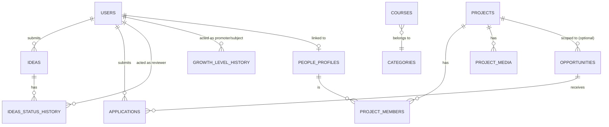

# Database — Rising Nation

**Proposed** data architecture — no migrations exist yet. Fields traced to `REQUIREMENTS.md` REQ-IDs where applicable; everything else is engineering inference needed to make the requirements buildable.

## Database Overview

**Why PostgreSQL:** the domain is heavily relational — People ↔ Projects ↔ Opportunities ↔ Applications, Courses ↔ Categories, Ideas with admin-owned review state and an audit trail. A document store would push these joins into application code and make referential integrity (an application pointing at a deleted opportunity) a code-level responsibility instead of a database guarantee. Given the platform's read patterns are predominantly filtered lists and joins, not deeply nested documents, this favors a relational engine.

**Data ownership:** the backend service is the sole writer to this database — no other system writes directly to it. Object storage (`ENGINEERING.md` §6.4) holds file bytes; the database holds only references to them.

**Core domains:** Identity (`users`), Public directory (`people_profiles`), Learning (`courses`, `categories`), Showcase (`projects`, `project_media`, `project_members`), Idea pipeline (`ideas`, `ideas_status_history`), Opportunities (`opportunities`, `applications`), Service intake (`enquiries`), Content ops (`events`, `announcements`), Growth (`growth_level_history`).

**Relationship model:** primarily one-to-many, with one explicit many-to-many join table (`project_members`). No entity in this schema requires a true many-to-many beyond project membership.

## Entity Specification

### `users`
**Purpose:** authentication/authorization identity — who can log in and what role they hold. Deliberately separate from `people_profiles` (public directory entries) because not every public profile has login credentials (an industry partner may never authenticate) and not every account needs a public bio (an admin account doesn't).

| Field | Type | Nullable | Default | Notes |
|---|---|---|---|---|
| `id` | uuid | No | generated | PK |
| `email` | string | No | — | UNIQUE |
| `password_hash` | string | No | — | bcrypt; never logged |
| `role` | enum | No | `'admin'` (V1) | `admin` in V1; `member` if OD-1 confirms |
| `growth_level` | enum, nullable | Yes | null | `learner\|contributor\|intern\|builder\|lead` — REQ-GROWTH-001 |
| `created_at` / `updated_at` | timestamptz | No | now() | |

### `people_profiles`
**Purpose:** public directory entry (REQ-PEOPLE-001/002).

| Field | Type | Nullable | Default | Notes |
|---|---|---|---|---|
| `id` | uuid | No | generated | PK |
| `user_id` | uuid FK → users | Yes | null | nullable, UNIQUE when set |
| `name` | string | No | — | REQ-PEOPLE-002 |
| `role_title` | string | No | — | REQ-PEOPLE-002 |
| `group` | enum | No | — | founding\|core\|contributor\|builder\|mentor\|industry\|partner — REQ-PEOPLE-001 |
| `short_intro` | text | Yes | — | REQ-PEOPLE-002 |
| `skills` | string[] | Yes | — | REQ-PEOPLE-002 |
| `linkedin_url` | string | Yes | — | REQ-PEOPLE-002 |
| `photo_url` | string | Yes | — | |
| `featured` | boolean | No | false | REQ-HOME-003 |
| `created_at` / `updated_at` | timestamptz | No | now() | |

**Deletion behavior:** `user_id` is `SET NULL` on the linked user's deletion — a profile must survive its login being deactivated (e.g., a founder's account is deactivated but their public bio remains).

### `categories`
**Purpose:** shared taxonomy for both Learning categories (REQ-LEARN-003) and Business/Creator service lists (REQ-BIZ-001/REQ-CREATOR-001).

| Field | Type | Nullable | Default | Notes |
|---|---|---|---|---|
| `id` | uuid | No | generated | PK |
| `name` | string | No | — | |
| `slug` | string | No | — | UNIQUE — stable URL/filter key |
| `type` | enum | No | — | `learning\|service` |

### `courses`
**Purpose:** REQ-LEARN. Carries the content-source abstraction required by REQ-LEARN-005/REQ-ADMIN-002.

| Field | Type | Nullable | Default | Notes |
|---|---|---|---|---|
| `id` | uuid | No | generated | PK |
| `title` | string | No | — | REQ-LEARN-004 |
| `description` | text | Yes | — | REQ-LEARN-004 |
| `level` | string | No | — | REQ-LEARN-004 |
| `category_id` | uuid FK → categories | No | — | RESTRICT on delete — a category with courses can't be deleted out from under them |
| `content_source` | enum | No | `'youtube'` | `youtube\|native` |
| `content_ref` | string | No | — | YouTube video/playlist ID, or future FK to `native_lessons` |
| `thumbnail_url` | string | Yes | — | cached at write time, see `ARCHITECTURE.md` §3.9 |
| `published` | boolean | No | true | |
| `created_at` / `updated_at` | timestamptz | No | now() | |

### `projects`
**Purpose:** REQ-PROJ.

| Field | Type | Nullable | Default | Notes |
|---|---|---|---|---|
| `id` | uuid | No | generated | PK |
| `name` | string | No | — | REQ-PROJ-001 |
| `client_or_category` | string | Yes | — | REQ-PROJ-001 |
| `problem` / `solution` / `result` | text | Yes | — | REQ-PROJ-001 |
| `technologies` | string[] | Yes | — | REQ-PROJ-001 |
| `status` | string | No | — | REQ-PROJ-001; no enum values specified by spec, kept free-text pending confirmation |
| `featured` | boolean | No | false | REQ-HOME-003 |
| `created_at` / `updated_at` | timestamptz | No | now() | |

### `project_media` (one-to-many from `projects`)
| Field | Type | Nullable | Notes |
|---|---|---|---|
| `id` | uuid | No | PK |
| `project_id` | uuid FK → projects | No | CASCADE on delete — media is meaningless orphaned |
| `media_url` | string | No | REQ-PROJ-001 |
| `media_type` | string | No | |

### `project_members` (many-to-many join, `projects` ↔ `people_profiles`)
| Field | Type | Notes |
|---|---|---|
| `project_id` | uuid FK → projects | |
| `profile_id` | uuid FK → people_profiles | |
| `contribution_role` | string | |

Implements REQ-PROJ-001's "team" as a real relation, so a contributor's project history is queryable from their own profile.

### `ideas`
**Purpose:** REQ-IDEA.

| Field | Type | Nullable | Default | Notes |
|---|---|---|---|---|
| `id` | uuid | No | generated | PK |
| `submitted_by` | uuid FK → users | Yes | null | null unless OD-1 confirms member accounts |
| `title` | string | No | — | REQ-IDEA-001 |
| `problem` / `proposed_solution` / `target_users` / `why_it_matters` | text | No | — | REQ-IDEA-001 |
| `current_stage` | string | No | — | REQ-IDEA-001 |
| `skills_team_required` | text | Yes | — | REQ-IDEA-001, optional |
| `document_url` / `demo_url` | string | Yes | — | REQ-IDEA-001, optional |
| `contact_email` | string | No | — | REQ-IDEA-001 |
| `contact_phone` | string | Yes | — | REQ-IDEA-001, optional |
| `status` | enum | No | `'submitted'` | see state machine, `ARCHITECTURE.md` §3.7 |
| `version` | integer | No | 1 | optimistic lock — see Data Integrity |
| `created_at` / `updated_at` | timestamptz | No | now() | |

### `ideas_status_history` (audit trail, one-to-many from `ideas`)
| Field | Type | Nullable | Notes |
|---|---|---|---|
| `id` | uuid | No | PK |
| `idea_id` | uuid FK → ideas | No | CASCADE on delete |
| `from_status` | enum | Yes | null on first submission |
| `to_status` | enum | No | |
| `notes` | text | Yes | |
| `actor_id` | uuid FK → users | No | requires individually-attributable admin accounts to be meaningful — see `ENGINEERING.md` §6.13 |
| `created_at` | timestamptz | No, default now() | |

Exists because REQ-IDEA-006 ("admin can review, shortlist, and update idea status") implies accountability for who changed what — a single mutable `status` column with no history can't answer "who changed this and why."

### `opportunities`
**Purpose:** REQ-OPP.

| Field | Type | Nullable | Default | Notes |
|---|---|---|---|---|
| `id` | uuid | No | generated | PK |
| `type` | enum | No | — | REQ-OPP-001 values |
| `title` | string | No | — | |
| `description` | text | Yes | — | |
| `related_project_id` | uuid FK → projects | Yes | null | SET NULL on delete — an opportunity can outlive its project |
| `open` | boolean | No | true | see Functional Rules, `REQUIREMENTS.md` |
| `created_at` | timestamptz | No | now() | |

### `applications` (one-to-many from `opportunities`)
| Field | Type | Nullable | Default | Notes |
|---|---|---|---|---|
| `id` | uuid | No | generated | PK |
| `opportunity_id` | uuid FK → opportunities | No | — | CASCADE on delete |
| `applicant_id` | uuid FK → users | Yes | null | null unless OD-1 confirms member accounts |
| `applicant_name` / `applicant_email` | string | No | — | REQ-OPP-002 |
| `message` | text | Yes | — | |
| `status` | enum | No | `'received'` | received\|reviewed\|accepted\|rejected |
| `created_at` | timestamptz | No | now() | |

### `enquiries`
**Purpose:** unifies REQ-BIZ-002 and REQ-CREATOR-002 — structurally identical forms with a `type` discriminator, avoiding duplicate tables/admin screens for a form that repeats.

| Field | Type | Nullable | Default | Notes |
|---|---|---|---|---|
| `id` | uuid | No | generated | PK |
| `type` | enum | No | — | `business_solutions\|creator_support` |
| `services_requested` | string[] | No | — | min 1; values validated against `categories(type='service')` |
| `contact_name` / `contact_email` | string | No | — | |
| `contact_phone` | string | Yes | — | |
| `message` | text | Yes | — | |
| `status` | enum | No | `'new'` | new\|contacted\|closed |
| `created_at` | timestamptz | No | now() | |

### `growth_level_history` (audit trail, one-to-many from `users`)
| Field | Type | Nullable | Notes |
|---|---|---|---|
| `id` | uuid | No | PK |
| `user_id` | uuid FK → users | No | CASCADE on delete |
| `from_level` / `to_level` | enum | to_level not null | |
| `reason` | text | No | required — REQ-GROWTH-RULE |
| `actor_id` | uuid FK → users | No | |
| `created_at` | timestamptz | No, default now() | |

### `announcements` / `events`
**Purpose:** REQ-ADMIN-001 lists these with zero field detail and no public-presentation description (Open Decision, `REQUIREMENTS.md`). Schemas below are placeholder-minimal pending confirmation.

| Table | Fields |
|---|---|
| `announcements` | `id`, `title`, `body`, `publish_at` |
| `events` | `id`, `title`, `description`, `starts_at`, `location` |

## Relationships

One-to-one: `users` to `people_profiles` (nullable, optional on both sides). One-to-many: the majority of the diagram — a category has many courses, a project has many media/members, an opportunity has many applications, an idea has many history entries. Many-to-many: `projects` to `people_profiles` via `project_members`.

## Indexing Strategy

| Query pattern | Index | Expected benefit |
|---|---|---|
| `GET /courses?category=` (every Learning page load, REQ-LEARN-001) | `courses(category_id, published)` | Composite index matches the exact filter combination used on the hub's primary read path. |
| `GET /projects?featured=true`, `GET /people?featured=true` (Home, REQ-HOME-003) | Partial index `WHERE featured = true` on each table | Smaller than a full index since `featured` is boolean and skewed toward `false`; serves Home's curated-list query directly. |
| `GET /people?group=` | `people_profiles(group)` | Full index — all group values queried roughly evenly (no skew to exploit with a partial index). |
| Admin review queues — `ideas(status)`, `enquiries(status)`, `applications(status)` | Standard index on each | Highest-traffic admin query pattern (REQ-ADMIN-001) — every review screen filters/sorts by status. |
| `GET /admin/applications?opportunity_id=` | `applications(opportunity_id)` | FK lookup for a specific opportunity's applicant list. |
| `GET /opportunities?type=&open=true` | Composite `opportunities(type, open)` | Public listing always filters `open = true`, frequently combined with `type` — matches the compound predicate. |
| Login | `users(email)` | Backed by the UNIQUE constraint itself. |
| Profile-for-logged-in-user lookup | `people_profiles(user_id)` | Low benefit at current expected scale, kept for FK-relationship correctness and future member-account growth. |

**Deliberately not indexed:** `ideas.contact_email`, `applications.applicant_email`, `enquiries.contact_email` — nothing in `API.md` searches by these; indexing PII fields that aren't queried adds write overhead and a second place the value exists (relevant to `ENGINEERING.md` §6.1 data-exposure entry) for zero read benefit.

## Data Integrity

**Constraints:** `NOT NULL` on every field marked required above; `UNIQUE` on `users.email`, `categories.slug`; `CHECK` constraints on enum-typed string columns where the database doesn't natively enforce enum membership (implementation-dependent on final ORM/migration tool choice).

**Referential integrity:** every FK above has an explicit `ON DELETE` behavior (CASCADE, SET NULL, or RESTRICT) — see each entity's notes. No FK is left to default behavior, since an unspecified cascade is a common source of silent data loss or orphaned rows.

**Race-condition protection — two places this matters concretely:**

1. **Idea status transitions** (`ideas.version`, optimistic locking): `PATCH` requests include the `version` last read; the `UPDATE` includes `WHERE id = $1 AND version = $2`. Zero rows affected implies another admin updated it first, so the request returns `409 Conflict` with the current row, rather than silently overwriting a concurrent edit. Paired with a transaction that atomically writes both the `ideas` row and its `ideas_status_history` entry — one without the other breaks the accountability `REQ-IDEA-006` implies.
2. **Opportunity applications vs. concurrent close** (Functional Rules, `REQUIREMENTS.md`): checking `opportunities.open = true` and inserting the `application` must happen in one transaction using `SELECT ... FOR UPDATE` on the opportunity row — a plain read-then-write has a gap where a late application can sneak in during the same instant an admin closes the opportunity.

**State transitions:** the `ideas.status` state machine (full diagram in `ARCHITECTURE.md` §3.7) is enforced at the service layer, not the database — Postgres constraints can verify a value is a legal enum member, but not that a *transition* between two specific values is legal in context; that's business logic, kept in one place (`ARCHITECTURE.md` §3.3 Service Layer) rather than duplicated as a database trigger.

**No soft deletion:** `deleted_at` columns are deliberately not added. Nothing in the requirements asks for recoverable deletion, and the admin-facing entities (Projects, People, Courses) are curated by a small trusted team where accidental deletion is a UX problem (confirm-before-delete in the admin UI) rather than a data-recovery problem. Revisit only if a "trash/restore" admin feature is explicitly requested.

## Migrations

No migration framework has been selected yet — that decision depends on the backend framework/ORM chosen during implementation kickoff, which is outside this document's scope. What's specified now, independent of tooling: migrations are version-controlled code, reviewed like any other change, and applied as a discrete deploy step before the new application version receives traffic (full sequencing in `ENGINEERING.md` §6.8). Migrations should be additive where possible — add a column nullable, backfill, tighten to `NOT NULL` in a follow-up migration — to avoid a deploy-time window where old application code and new schema are incompatible during a rolling deploy.

## Database Performance

- **N+1 risk:** the clearest candidate is `GET /projects/:id` rendering team members and media together — the repository layer should fetch these via explicit joins or a single batched query, not one query per related row. Flagged here so it's designed against from the first implementation, not discovered in a profiler later.
- **Missing indexes:** addressed proactively in the Indexing Strategy above, reasoned against actual query patterns rather than added speculatively.
- **Large result sets / pagination:** every list endpoint in `API.md` is paginated (offset/limit, default 20, server-capped at 100) — no endpoint returns an unbounded collection.
- **Expensive joins:** none anticipated at this schema's scale — the deepest join (a project's members, joined through `project_members` to `people_profiles`) is two hops, not a concern at expected data volumes.
- **Connection pooling:** recommended (e.g., PgBouncer or a managed provider's built-in pooler) once more than one backend instance runs concurrently (`ENGINEERING.md` §6.8) — a single instance at launch doesn't need it, but the design shouldn't preclude adding it.
- **Transaction boundaries:** kept as short as possible and limited to the two workflows that genuinely need them (idea status transition, opportunity application) — see Data Integrity above. No transaction spans an external call — the YouTube Data API validation in course writes happens before the database transaction opens, not inside it, so a slow external call never holds a database lock.

## Data Lifecycle

| Entity | Creation | Updates | Publication | Archival/Deletion | Retention |
|---|---|---|---|---|---|
| Courses/Projects/People | Admin | Admin | `published`/implicit visibility flag | Hard delete (no soft-delete, see Data Integrity) | Indefinite |
| Ideas | Public submission | Admin (status only, audited) | N/A — always visible to admin, never public | Not deletable in V1 admin UI — ideas are permanent records; rejection is a `status`, not a deletion | Open Decision — see `ENGINEERING.md` §6.13 |
| Applications/Enquiries | Public submission | Admin (status only) | N/A | Not addressed — no deletion UI specified | Open Decision |
| Growth level | Admin, audited | N/A (append-only history) | N/A | N/A | Indefinite |
