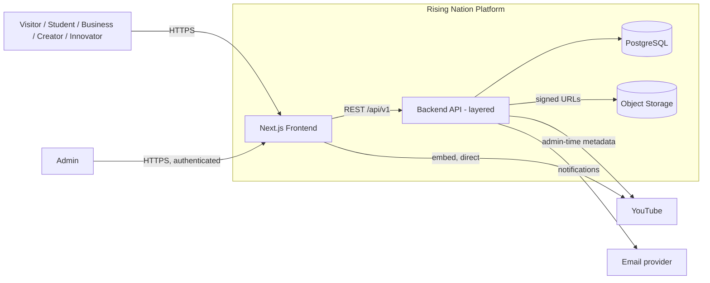

# Rising Nation — Technical Specification

## Project Overview

Rising Nation is a technology/innovation organization platform. It serves four groups through one system: **students** get free curated learning plus real-project contribution and a progression ladder; **innovators** get a public idea-submission and evaluation pipeline; **business clients** and **content creators** each get a service-enquiry funnel. All four feed shared Projects and People showcases, managed through a single admin/CMS layer.

**Who it serves:** Visitors browsing the platform's four entry points; Students working through Learning and real project contribution; Business clients and Creators seeking paid services; Innovators submitting ideas; Admin/internal team managing all content and workflow state.

## Product Capabilities

- **Student Innovation Hub:** category-browsable free courses (YouTube-sourced today, swappable to native courses later without a rebuild), real-project contribution, and a Learner → Contributor → Intern → Builder → Lead growth ladder.
- **Idea Submission:** public intake form, admin review pipeline (Review → Evaluation → Credits/Recognition → Possible Development), with an explicit constraint that no submission is promised funding or development.
- **Business Solutions & Creator Support:** curated service lists with enquiry forms.
- **Projects & People showcase:** curated, admin-managed, featurable on Home.
- **Opportunities:** listings across Learner/Contributor/Internship/Mentorship/Industry/Open-position types, with an application system.
- **Admin/CMS:** full content management across every domain above, without requiring a redeploy for routine content changes.

## Technology Stack

| Layer | Choice | Status |
|---|---|---|
| Frontend | Next.js (React) | Proposed |
| Backend | Node.js/Express, layered (API → Service → Repository) | Proposed |
| Database | PostgreSQL | Proposed |
| Object storage | S3-compatible, signed-URL upload | Proposed |
| Video | YouTube Data API (admin-time only) + client-side iframe embed | Proposed, required by spec |
| Auth | Session-based, role-based (admin-only in V1) | Proposed |
| Hosting | Not selected | Open Decision |

No technology above is confirmed by the client — all are engineering proposals, detailed with reasoning in `ARCHITECTURE.md` §3.10.

## High-Level Architecture

## Major Components

- **Frontend:** public marketing/showcase pages plus the admin panel, same codebase.
- **Backend:** single stateless API service, layered (routing → auth/validation middleware → service layer → repository → database) — see `ARCHITECTURE.md` §3.2–3.3 for why this shape.
- **Database:** PostgreSQL, chosen for the domain's relational structure — see `DATABASE.md`.
- **Authentication:** session-based, admin-only in V1 pending confirmation of whether general users need accounts — see `ARCHITECTURE.md` §3.6.
- **Storage:** signed-URL direct-to-storage uploads for screenshots, thumbnails, photos, and idea documents — see `ENGINEERING.md` §6.4.
- **External integrations:** YouTube (metadata validation + embed), email (notifications, password reset) — see `ARCHITECTURE.md` §3.9.
- **Admin system:** purpose-built, not a generic headless CMS, because admin actions are workflow transitions (idea review) as much as content CRUD — see `ARCHITECTURE.md` AD-4.

## Documentation Map

| Document | Contents |
|---|---|
| [`REQUIREMENTS.md`](./REQUIREMENTS.md) | Product goals, actors, functional requirements (REQ-IDs), user flows, business rules, non-functional requirements, scope, open product decisions. |
| [`ARCHITECTURE.md`](./ARCHITECTURE.md) | System design: context, layering, request lifecycle, domain architecture, auth model, workflow contracts, transactions/concurrency, external services, architecture decisions, architecture risks. |
| [`API.md`](./API.md) | Full REST contract, endpoint-by-endpoint, requirement traceability, and an API design review. |
| [`DATABASE.md`](./DATABASE.md) | Entity specifications, ER diagram, indexing rationale, data integrity/concurrency handling, migration approach, performance review, data lifecycle. |
| [`ENGINEERING.md`](./ENGINEERING.md) | Security threat model, validation/error models, file security, observability, testing strategy, performance/scalability, deployment, configuration, development workflow, implementation roadmap, engineering risks, open decisions register. |

## Getting Started

No implementation exists yet, so this section documents **intended** setup rather than working commands.

- **Prerequisites (proposed):** Node.js runtime, a local or containerized PostgreSQL instance, environment variables per `ENGINEERING.md` §6.9.
- **Local development (proposed, not yet buildable):** run the backend against a local database with migrations applied, run the frontend against the local backend. Exact commands depend on the framework/tooling choices made at implementation kickoff — not fabricated here.
- **Running tests:** strategy defined in `ENGINEERING.md` §6.6; specific command wiring depends on the eventual test runner choice.
- **First deploy:** requires resolving the Phase-0 decisions in `ENGINEERING.md` §6.11 (auth scope, idea-status values, admin account model) before schema/API code is written.

## Project Status

**Phase:** Pre-build / planning. No code exists.

**Defined (Confirmed by the client spec):** full functional scope (`REQUIREMENTS.md`), the four core user journeys, the hard constraint that Learning must support YouTube now and native courses later without a redesign.

**Proposed (engineering design, pending sign-off):** the entire technical stack, layered backend architecture, database schema, API contract, and security model in `ARCHITECTURE.md`, `API.md`, `DATABASE.md`, `ENGINEERING.md`.

**Undecided (Open Decisions, `ENGINEERING.md` §6.13):** eleven items, three of which (member-account scope, exact idea-status workflow, admin account model) block schema/API work and are sequenced as Phase 0 in `ENGINEERING.md` §6.11 ahead of everything else.

**Labeling convention used throughout this set:** **Confirmed** (stated in the client spec) / **Proposed** (the selected technical design) / **Inferred** (a necessary engineering interpretation of what's confirmed) / **Recommended** (a suggested improvement, not mandated) / **Open Decision** (cannot be responsibly decided without client input). No document in this set blurs these categories — a claim that isn't explicitly Confirmed is one of the other four, always labeled.
