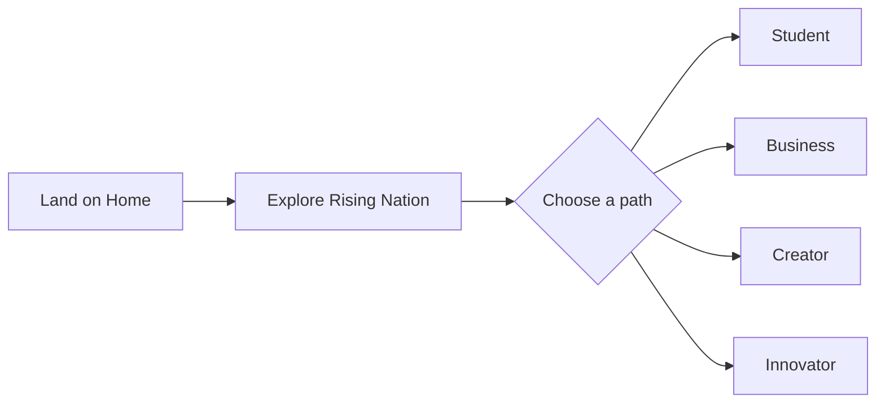
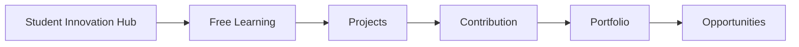
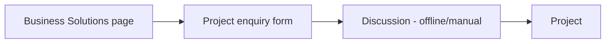
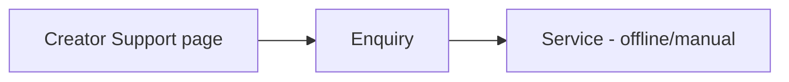
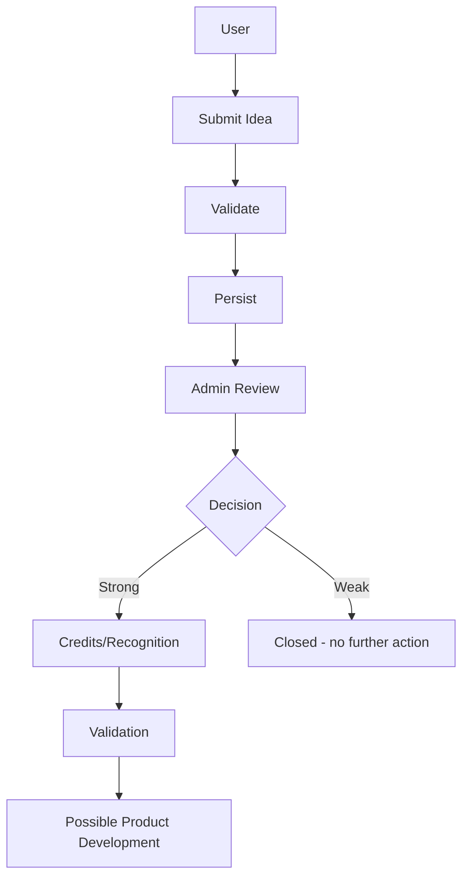

# Requirements — Rising Nation

Source: `RN-START-UPDATED.pdf` ("Rising Nation Website — Development Requirements"). This is the authoritative functional specification — if any other document in this set disagrees with it, the other document is wrong. Every requirement below is **Confirmed** unless tagged **Inferred**. Requirement IDs (`REQ-<DOMAIN>-<N>`) are introduced here for traceability into `API.md`.

## Product Goals

Rising Nation is a technology/innovation organization platform serving four purposes at once: free technical education with real project experience (Student Innovation Hub), a public idea-intake and evaluation pipeline (Idea Submission), a service-enquiry funnel for paying clients (Business Solutions), and a service-enquiry funnel for content creators (Creator Support). All four surface into shared Projects and People showcases, managed through a single admin/CMS layer. The platform must read as a professional technology/innovation organization — not a college club or generic agency (Confirmed, Final Requirement).

## Users / Actors

| Actor | Responsibilities | Capabilities | Access level |
|---|---|---|---|
| **Visitor** | Browses public content, chooses a path | Read all published content; submit Idea, Enquiry, Application | Public, unauthenticated |
| **Student** | Learns, contributes to real projects, progresses through the Growth ladder | Same as Visitor; progression tracked by admin | Public (V1) — see `REQ-AUTH-001` |
| **Business client** | Seeks paid services | Submit project enquiry | Public |
| **Creator** | Seeks content/growth services | Submit creator enquiry | Public |
| **Innovator** | Submits an idea for evaluation | Submit idea, no further platform access required | Public |
| **Admin** | Reviews and manages all content and workflow state | Full CRUD on Courses, Projects, People, Opportunities, Ideas, Events, Announcements, website content; review/transition idea status; set growth level | Authenticated, `role = admin` |

**Inferred:** Student/Business/Creator/Innovator are behavioral roles, not distinct accounts — the same anonymous visitor can act as any of them in a single session, since V1 has no login for non-admin users (`REQ-AUTH-001`).

## Functional Requirements

### Home (`REQ-HOME`)

- `REQ-HOME-001`: Home displays Rising Nation introduction, vision + mission, ecosystem explanation.
- `REQ-HOME-002`: Home surfaces four entry points: Student Innovation Hub, Business Solutions, Creator Support, Idea → Product.
- `REQ-HOME-003`: Home displays featured projects and featured people/community. **Inferred:** requires a `featured` flag on Projects and People so admin curates what appears, rather than Home querying full lists.
- `REQ-HOME-004`: Primary CTA — Join / Work With Us / Submit an Idea.

### About (`REQ-ABOUT`)

- `REQ-ABOUT-001`: Static/CMS-editable content — Who we are, Why we started, Vision, Mission, What we believe, What we are building, Future direction. **Inferred:** pure content, no relational entities.

### Student Innovation Hub — Learning (`REQ-LEARN`)

- `REQ-LEARN-001`: Free courses/resources arranged by category.
- `REQ-LEARN-002`: Each course opens the relevant YouTube playlist/video (embed or external redirect).
- `REQ-LEARN-003`: Categories (non-exhaustive): Web Development, AI/ML, DevOps, Cybersecurity/Ethical Hacking, Data, Design, Marketing, Business.
- `REQ-LEARN-004`: Course card fields — thumbnail, name, short description, level, YouTube link.
- `REQ-LEARN-005` **(hard constraint)**: the system must allow replacing YouTube-sourced courses with Rising Nation's own courses later **without redesigning the system.**

### Student Innovation Hub — Build (`REQ-BUILD`)

- `REQ-BUILD-001`: Real projects, team participation, contributor opportunities, practical assignments, portfolio building, mentorship, industry exposure. **Inferred:** implemented via the Projects (`REQ-PROJ`) and Opportunities (`REQ-OPP`) domains, not a separate content type — a contributor opportunity on a real project is an Opportunity scoped to a Project.

### Student Innovation Hub — Growth (`REQ-GROWTH`)

- `REQ-GROWTH-001`: Ladder — Learner → Contributor → Intern → Builder → Lead.
- `REQ-GROWTH-002`: Progression depends on work, consistency, contribution, and capability — not time-in-program or self-declaration. **Inferred:** admin-driven promotion with an auditable justification, not an automatic formula (see `REQ-GROWTH-RULE` below).

### Idea Submission (`REQ-IDEA`)

- `REQ-IDEA-001`: Public submission form — title, problem being solved, proposed solution, target users, why the idea matters, current stage, skills/team required, optional document/demo/link, contact details.
- `REQ-IDEA-002`: Pipeline — Idea → Review → Evaluation → Credits/Recognition → Possible Development.
- `REQ-IDEA-003`: Good ideas receive recognition/credits based on quality and contribution.
- `REQ-IDEA-004`: Strong ideas can be considered for further validation/development.
- `REQ-IDEA-005` **(hard constraint)**: the platform must not promise funding or product development for every submission — applies to confirmation copy and status messaging, not only data.
- `REQ-IDEA-006`: Admin/team can review, shortlist, and update idea status.

### Business Solutions (`REQ-BIZ`)

- `REQ-BIZ-001`: Services listed — Website development, Software development, AI solutions, Automation, Digital solutions, Branding, Content, Social media, Marketing, Product development, Maintenance/support.
- `REQ-BIZ-002`: Project enquiry form. **Inferred:** must capture which service(s) the enquiry concerns; services are curated (CMS-editable), not user-invented.

### Creator Support (`REQ-CREATOR`)

- `REQ-CREATOR-001`: Services listed — Reels/video editing, Content creation, Content strategy, Branding, Instagram management, Growth support, Account management.
- `REQ-CREATOR-002`: Creator enquiry form.

### Idea → Product explainer (`REQ-I2P`)

- `REQ-I2P-001`: Process shown — IDEA → VALIDATE → DESIGN → BUILD → TEST → LAUNCH → GROW. Teams referenced — Technology, Product, Design, AI, Marketing, Business support, Industry guidance. CTA — "Submit Your Idea." **Inferred:** presentational; reuses `REQ-IDEA`'s form and pipeline rather than introducing a new one.

### Projects (`REQ-PROJ`)

- `REQ-PROJ-001`: Per-project fields — name, client/category, problem, solution, technologies, team, result, screenshots/media, status. **Inferred:** "team" is a relation to People profiles (`REQ-PEOPLE`), not free text, so a contributor's project history is visible on their own profile.

### People & Network (`REQ-PEOPLE`)

- `REQ-PEOPLE-001`: Groups — Founding Team, Core Team, Contributors, Builders, Mentors, Industry Professionals, Partners.
- `REQ-PEOPLE-002`: Per-profile fields — Name, Role, Short introduction, Skills/Expertise, LinkedIn. **Inferred:** "group" is a category/tag on one entity, not seven tables — a person can hold more than one.

### Opportunities (`REQ-OPP`)

- `REQ-OPP-001`: Types — Learner, Contributor, Internship, Project opportunities, Mentorship, Industry opportunities, Open positions.
- `REQ-OPP-002`: Application system.

### Admin / Content Management (`REQ-ADMIN`)

- `REQ-ADMIN-001`: Admin can add/edit/remove — Courses, YouTube links, Thumbnails, Projects, Team members, Opportunities, Ideas, Mentors, Events, Announcements, Website content.
- `REQ-ADMIN-002` **(hard constraint, restated)**: Learning system supports YouTube-based free learning now and native courses later, without a rebuild (same constraint as `REQ-LEARN-005`).

### Authentication (`REQ-AUTH`) — Inferred, not directly stated

- `REQ-AUTH-001`: Admin actions require authentication (Confirmed, implied by `REQ-ADMIN-001`/`REQ-IDEA-006`). Whether general visitors/students require accounts is **Open Decision OD-1** — see below.

## User Flows

### Visitor

### Student

Growth ladder progression applies within this flow but is admin-driven, not a self-service step.

### Business

### Creator

### Innovator (idea submission, detailed)

Section 7's public "Idea → Product" explainer reuses this same pipeline and CTA — it is not a distinct flow.

## Functional Rules

- **Who can submit an idea/enquiry/application?** Anyone — no authentication required (`REQ-IDEA-001`, `REQ-BIZ-002`, `REQ-CREATOR-002`, `REQ-OPP-002`).
- **Who can review ideas and change their status?** Admin only (`REQ-IDEA-006`).
- **What makes an Opportunity "open"?** **Inferred, not specified:** proposed as a boolean flag admin toggles directly — the spec doesn't define an automatic closing condition (e.g., a deadline or an applicant cap). Treated as an admin action only unless told otherwise.
- **What happens when an idea is not selected for further development?** **Not specified.** The spec describes the positive path (review → evaluation → credits → possible development) but not an explicit rejection state or notification. Proposed as a terminal status (e.g., `closed`) reachable from review/evaluation, with no promise of notification — flagged as `REQ-GROWTH-RULE` open item below rather than invented.
- **How are Projects related to Ideas?** **Not specified.** The spec never states that an idea, once developed, becomes a Project record, or how that linkage would be tracked. Treated as a manual admin action (admin creates a Project separately once an idea is greenlit) rather than an automatic conversion, since no field or relationship for this is described.
- **How is recognition/credit assigned?** **Not specified beyond the outcome** ("good ideas receive recognition/credits based on quality and contribution" — `REQ-IDEA-003`). The mechanism (points, badges, certificate, nothing user-facing) is Open Decision OD-8.
- **REQ-GROWTH-RULE:** growth-level changes require admin action and a stated reason; no automatic promotion formula exists because the spec ties progression to a qualitative judgment ("capability") the data can't compute unassisted.

## Non-Functional Requirements

| Category | Requirement |
|---|---|
| Performance | Fast page loads (Confirmed, Final Requirement — "fast performance"); no numeric target specified — treated as Open Decision OD-2 if a client SLA is required later. |
| Availability | No explicit uptime target specified. Standard managed-hosting availability assumed sufficient given no stated business-critical real-time dependency. |
| Scalability | "Ready to expand as Rising Nation grows" (Confirmed) — interpreted as: no unbounded queries, pagination on all list views, schema that supports growth without redesign (directly drives `REQ-LEARN-005`). |
| Security | Not explicitly specified beyond implied admin-gating (`REQ-AUTH-001`). Full threat model in `ENGINEERING.md` §6.1. |
| Accessibility | Not specified. No WCAG target stated — Recommended baseline (semantic HTML, sufficient color contrast) rather than a formal compliance target, pending client confirmation. |
| Mobile | **Confirmed, explicit** — "mobile-first" (Final Requirement). |
| Maintainability | "Easy content management" (Confirmed) — drives the admin/CMS design in `ARCHITECTURE.md`. |

## Scope

### MVP
Home, About, Learning (YouTube-sourced), Business Solutions + enquiry, Creator Support + enquiry, Projects showcase, People & Network directory, Idea Submission + admin review, Admin CRUD for the above, admin-only authentication.

### Post-MVP
Opportunities + application system, growth ladder admin UI, Events, Announcements, member accounts (if OD-1 confirms they're needed).

### Future
Native course hosting, Credits/Recognition mechanism (once OD-8 is resolved), student portfolio pages.

## Open Product Decisions

Materially affects backend architecture — full register with defaults and owners in `ENGINEERING.md` §6.13. Listed here because they originate from requirements ambiguity, not engineering preference:

- **OD-1**: Do Students/Creators/Innovators need accounts, or is admin the only authenticated role?
- **OD-2**: Any specific performance SLA (page load time, uptime) the client requires?
- **OD-3**: Exact idea-status values and the review team's actual process.
- **OD-4**: Should the same person be blocked from applying twice to one Opportunity?
- **OD-5**: What static content blocks actually need CMS editing beyond the sections explicitly named?
- **OD-6**: Hosting provider preference.
- **OD-7**: Do Events/Announcements need public pages, and what fields do they need?
- **OD-8**: What does "Credits/Recognition" actually consist of?
